<p align="center">
    
</p>

## AdaptIR: Parameter Efficient Multi-task Adaptation for Pre-trained Image Restoration Models

[[Paper](https://arxiv.org/abs/2308.15070)]  [[Suppl]()] [Project Page]


[Hang Guo](https://github.com/csguoh), [Tao Dai](https://cstaodai.com/), [Yuanchao Bai](https://scholar.google.com/citations?user=hjYIFZcAAAAJ&hl=zh-CN), Bin Chen, [Shu-Tao Xia](https://scholar.google.com/citations?hl=zh-CN&user=koAXTXgAAAAJ), Zexuan Zhu


<p align="center">
    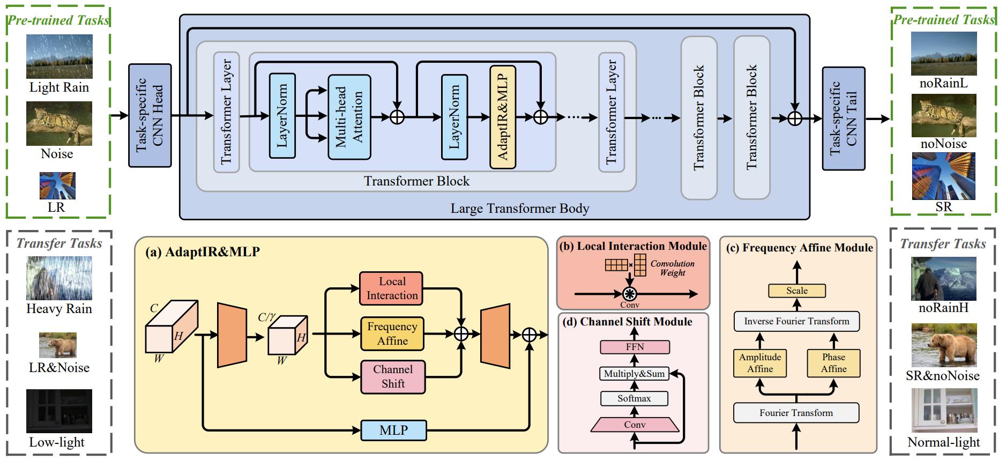
</p>

⭐If this work is helpful for you, please help star this repo. Thanks!🤗


## 📑 Contents

- [Visual Results](#visual_results)
- [News](#news)
- [TODO](#todo)
- [Results](#results)
- [Citation](#cite)


## <a name="visual_results"></a>:eyes:Visual Results On Different Restoration Tasks
[](https://imgsli.com/MjI1Njk3) [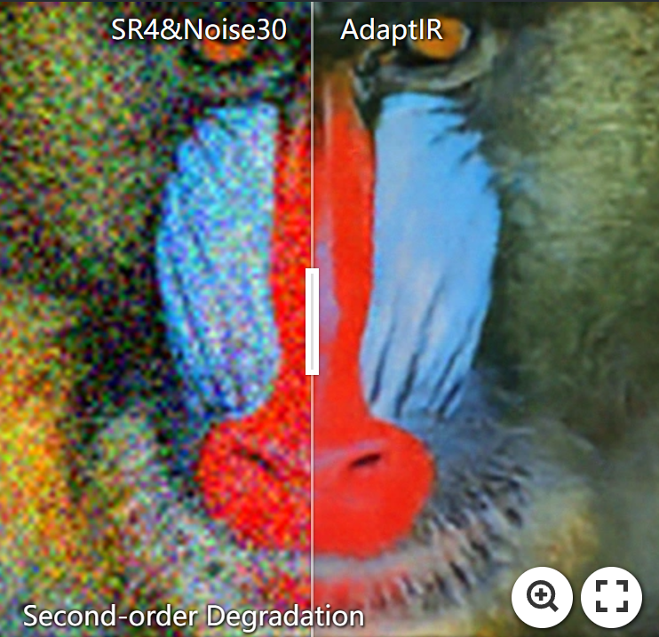](https://imgsli.com/MjI1NzIx) [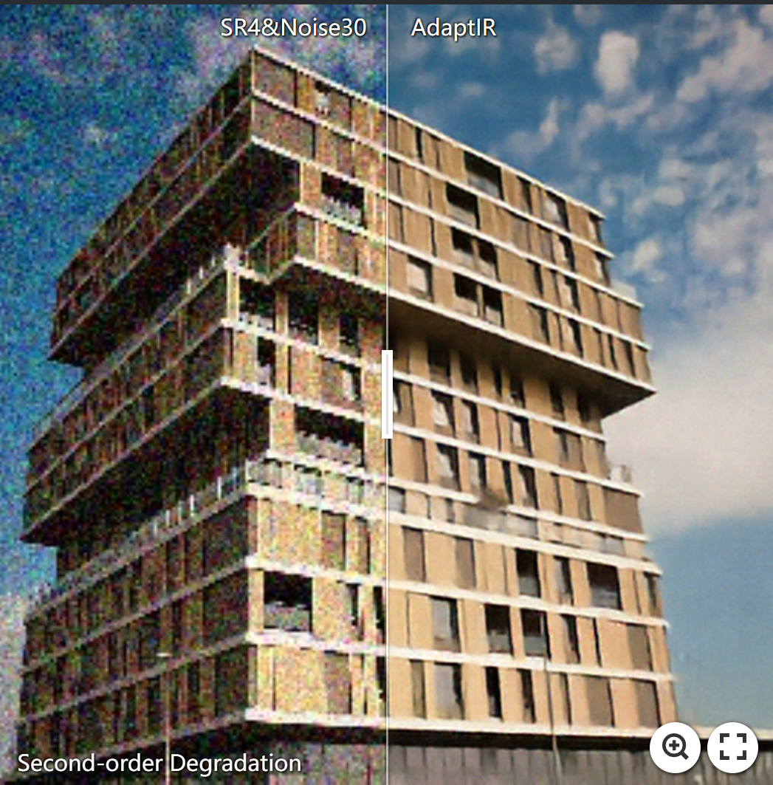](https://imgsli.com/MjI1NzEx) [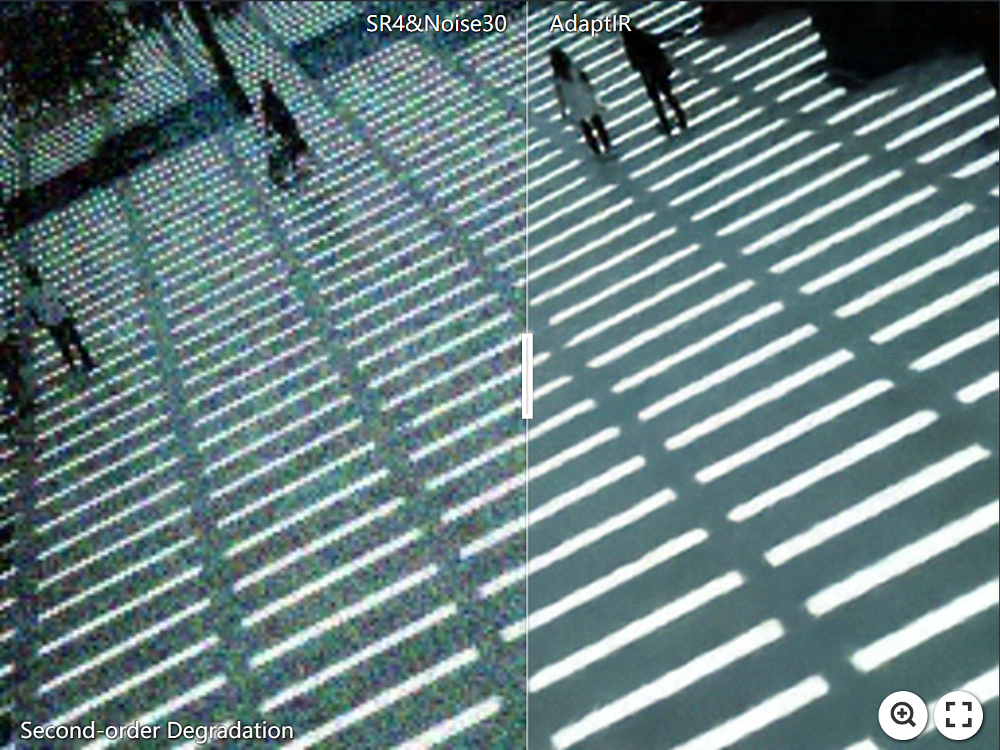](https://imgsli.com/MjI1NzAw)

[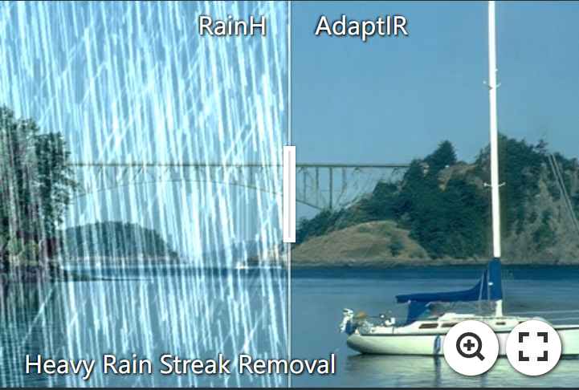](https://imgsli.com/MjI1NzAz) [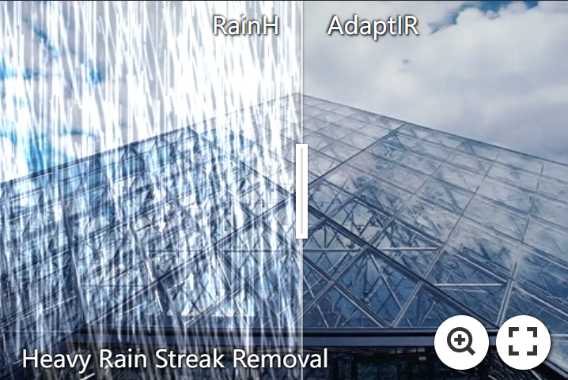](https://imgsli.com/MjI1NzAx) [](https://imgsli.com/MjI1NzE2)


## <a name="news"></a> 🆕 News

- **2023-12-13:** Arixv paper available.
- **2023-12-14:** This repo is released.


## <a name="todo"></a> ☑️ TODO

- [x] Arixv version
- [ ] Supplementary matrial
- [ ] Project page
- [ ] Release code
- [ ] Pretrained weights
 

## <a name="results"></a> 🥇 Results

We achieve state-of-the-art adaptation performance on various downstream image restoration tasks. Detailed results can be found in the paper.

<details>
<summary>Evaluation on Second-order Degradation (LR4&Noise30) (click to expand)</summary>

<p align="center">
  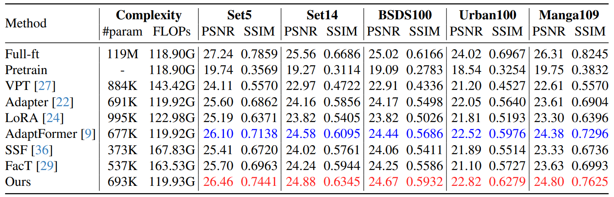
</p>
</details>


<details>
<summary>Evaluation on Classic SR (click to expand)</summary>

<p align="center">
  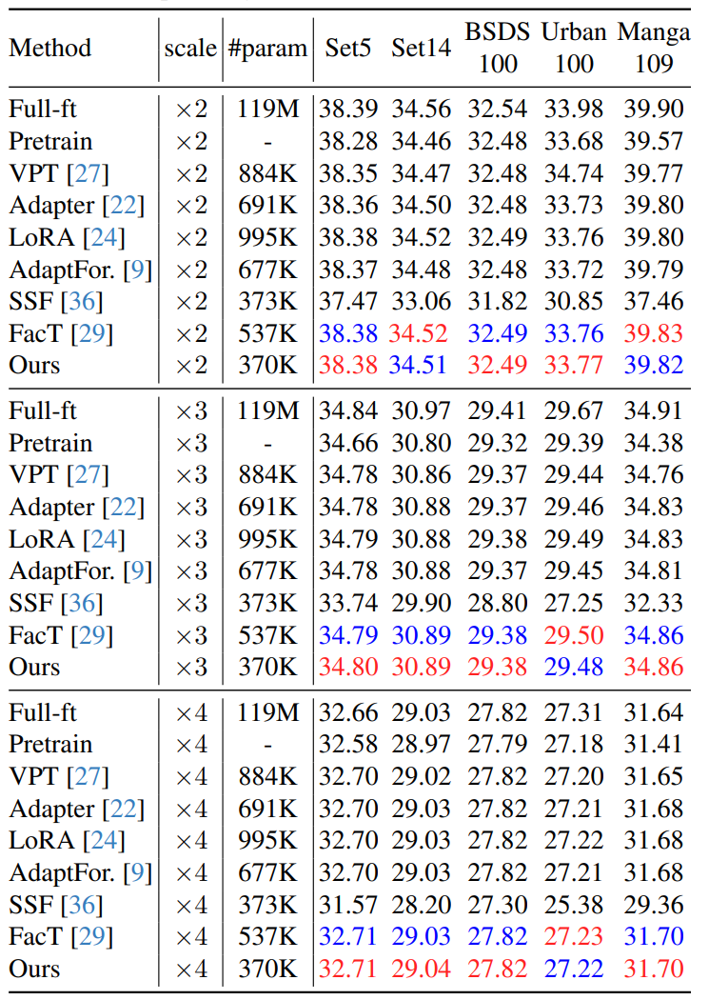
</p>
</details>


<details>
<summary>Evaluation on Denoise&DerainL (click to expand)</summary>

<p align="center">
  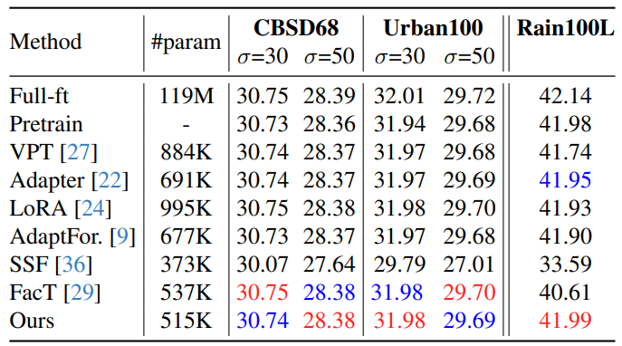
</p>
</details>


<details>
<summary>Evaluation on Heavy Rain Streak Removal (click to expand)</summary>

<p align="center">
  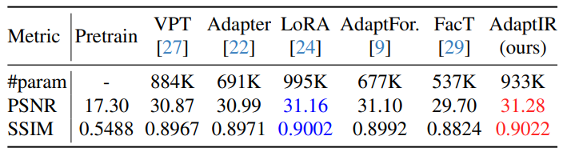
</p>
</details>


<details>
<summary>Evaluation on Low-light Image Enhancement (click to expand)</summary>

<p align="center">
  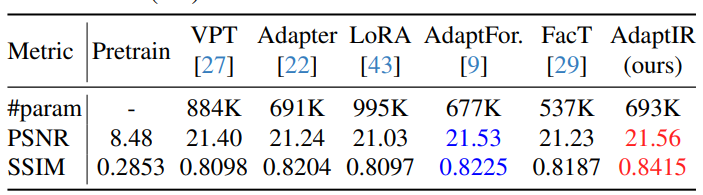
</p>

</details>


<details>
<summary>Evaluation on Model Scalability (click to expand)</summary>

<p align="center">
  
</p>

</details>


## <a name="cite"></a> 🥰 Citation

Please cite us if our work is useful for your research.

```

```

## License

This project is released under the [Apache 2.0 license](LICENSE).

## Acknowledgement

This code is based on [AirNet](https://github.com/XLearning-SCU/2022-CVPR-AirNet), [IPT](https://github.com/huawei-noah/Pretrained-IPT) and [EDT](https://github.com/fenglinglwb/EDT). Thanks for their awesome work.

## Contact

If you have any questions, feel free to approach me at cshguo@gmail.com

