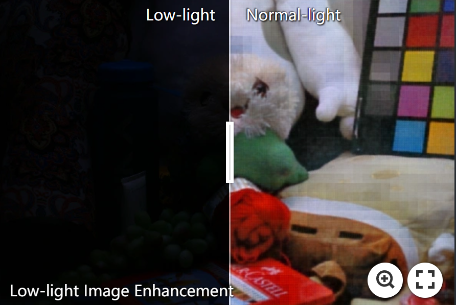
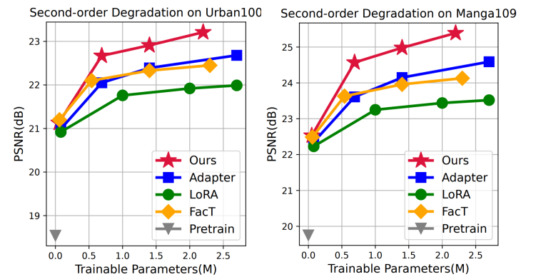

<p align="center">
    
</p>

## AdaptIR: Parameter Efficient Multi-task Adaptation for Pre-trained Image Restoration Models

## [[Paper](https://arxiv.org/pdf/2312.08881.pdf)] 

[Hang Guo](https://github.com/csguoh), [Tao Dai](https://cstaodai.com/), [Yuanchao Bai](https://scholar.google.com/citations?user=hjYIFZcAAAAJ&hl=zh-CN), Bin Chen, Xudong Ren, Zexuan Zhu, [Shu-Tao Xia](https://scholar.google.com/citations?hl=zh-CN&user=koAXTXgAAAAJ)


> **Abstract:**  Designing single-task image restoration models for specific degradation has seen great success in recent years. To achieve generalized image restoration, all-in-one methods have recently been proposed and shown potential for multiple restoration tasks using one single model. Despite the promising results, the existing all-in-one paradigm still suffers from high computational costs as well as limited generalization on unseen degradations. In this work, we introduce an alternative solution to improve the generalization of image restoration models. Drawing inspiration from recent advancements in Parameter Efficient Transfer Learning (PETL), we aim to tune only a small number of parameters to adapt pre-trained restoration models to various tasks. However, current PETL methods fail to generalize across varied restoration tasks due to their homogeneous representation nature. To this end, we propose AdaptIR, a Mixture-of-Experts (MoE) with orthogonal multi-branch design to capture local spatial, global spatial, and channel representation bases, followed by adaptive base combination to obtain heterogeneous representation for different degradations. Extensive experiments demonstrate that our AdaptIR achieves stable performance on single-degradation tasks, and excels in hybrid-degradation tasks, with fine-tuning only 0.6% parameters for 8 hours.


<p align="center">
    
</p>

⭐If this work is helpful for you, please help star this repo. Thanks!🤗


## 📑 Contents

- [Visual Results](#visual_results)
- [News](#news)
- [TODO](#todo)
- [Results](#results)
- [Citation](#cite)


## <a name="visual_results"></a>:eyes:Visual Results On Different Restoration Tasks
[](https://imgsli.com/MjI1Njk3) [](https://imgsli.com/MjI1NzIx) [](https://imgsli.com/MjI1NzEx) [](https://imgsli.com/MjI1NzAw)

[](https://imgsli.com/MjI1NzAz) [](https://imgsli.com/MjI1NzAx) [](https://imgsli.com/MjI1NzE2)


## <a name="news"></a> 🆕 News

- **2023-12-12:** arXiv paper available.
- **2023-12-16:** This repo is released.
- **2023-09-28:** 😊Our AdaptIR was accepted by NeurIPS2024!
- **2024-10-19:**🔈The code is available now, enjoy yourself!


## <a name="todo"></a> ☑️ TODO

- [x] arXiv version
- [x] Release code
- [ ] More detailed introductions of README file 
- [ ] Further improvements


## <a name="results"></a> 🥇 Results

We achieve state-of-the-art adaptation performance on various downstream image restoration tasks. Detailed results can be found in the paper.

<details>
<summary>Evaluation on Second-order Degradation (LR4&Noise30) (click to expand)</summary>

<p align="center">
  
</p>
</details>


<details>
<summary>Evaluation on Classic SR (click to expand)</summary>

<p align="center">
  
</p>
</details>


<details>
<summary>Evaluation on Denoise&DerainL (click to expand)</summary>

<p align="center">
  
</p>
</details>


<details>
<summary>Evaluation on Heavy Rain Streak Removal (click to expand)</summary>

<p align="center">
  
</p>
</details>


<details>
<summary>Evaluation on Low-light Image Enhancement (click to expand)</summary>

<p align="center">
  
</p>

</details>


<details>
<summary>Evaluation on Model Scalability (click to expand)</summary>

<p align="center">
  
</p>
</details>


## <a name="results"></a> Datasets & Models Preparation

### Datasets

Since this work involves various restoration tasks, you may collect the training and testing datasets you need from existing repos, such as [Basicsr](https://github.com/XPixelGroup/BasicSR/blob/master/docs/DatasetPreparation.md), [Restormer](https://github.com/swz30/Restormer/tree/main), and [PromptIR](https://github.com/va1shn9v/PromptIR/blob/main/INSTALL.md).


### Pre-trained weights

- IPT pre-trained models
download the `IPT_pretrain` with the [link](https://drive.google.com/drive/folders/1MVSdUX0YBExauG0fFz4ANiWTrq9xZEj7) of the [IPT repo](https://github.com/huawei-noah/Pretrained-IPT).


- EDT pre-trained models
download the `SRx2x3x4_EDTB_ImageNet200K.pth` with the [link](https://mycuhk-my.sharepoint.com/:f:/g/personal/1155137927_link_cuhk_edu_hk/Eikt_wPDrIFCpVpiU0zYNu0BwOhQIHgNWuH1FYZbxZhq_w?e=bVEVeW) of the [EDT repo](https://github.com/fenglinglwb/EDT)


## <a name="cite"></a> 🥰 Citation

Please cite us if our work is useful for your research.

```
@article{guo2023adaptir,
  title={AdaptIR: Parameter Efficient Multi-task Adaptation for Pre-trained Image Restoration Models},
  author={Guo, Hang and Dai, Tao and Bai, Yuanchao and Chen, Bin and Xia, Shu-Tao and Zhu, Zexuan},
  journal={arXiv preprint arXiv:2312.08881},
  year={2023}
}
```

## License

This project is released under the [Apache 2.0 license](LICENSE).

## Acknowledgement

This code is based on [AirNet](https://github.com/XLearning-SCU/2022-CVPR-AirNet), [IPT](https://github.com/huawei-noah/Pretrained-IPT) and [EDT](https://github.com/fenglinglwb/EDT). Thanks for their awesome work.

## Contact

If you have any questions, feel free to approach me at cshguo@gmail.com

